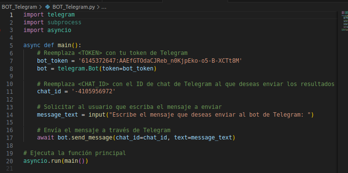
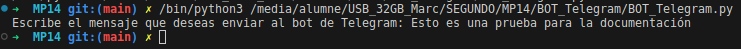
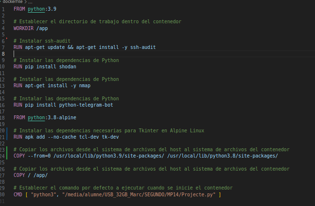
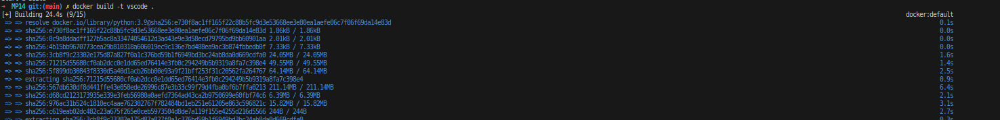

# Consulta API Shodan en Python
## 1. Realitza un petit programa que pregunti una ip a l'usuari i mostri la informació d'aquesta IP rebuda des de l'API de shodan.
Lo primero que tendremos que hacer será descargarno la libreria shodan usando el siguiente comando pip
"pip install shodan"

Despues tenemos que crearnos una cuenta de shodan y buscar la api key

El codigo que hemos usado sirve para preguntar una IP a un usuario y que reciba información relacionada con esta IP

El problema que nos hemos encontrado es que la API de Shodan no funciona de manera correcta y nos da un problema de "Acceso Denegado" cuando todo funciona de manera correcta

## 2. Modifica l'script per a que mostri únicament els noms de domini associats a la Ip i els ports oberts que ha trobat Shodan.

Modificaremos el codigo anterior de tal manera que ahora simplemente muestre los nombres de dominio y los puertos abiertos

En esta versión modificada, hemos añadido dos bucles for para imprimir los nombres de dominio asociados a la IP y los puertos abiertos. Esto se hace utilizando las claves hostnames y ports en el resultado de la consulta a la API de Shodan.

## 3. Afegeix una funció que a partir de la informació anterior ens digui quin servei hi ha en cadascun dels ports oberts trobats.

Hemos añadido un bucle for adicional para iterar sobre la lista de puertos y determinar qué servicio se está ejecutando en cada uno de ellos. Esto se hace utilizando las claves port y module en la respuesta de la API de Shodan.

## 4. Afegeix una funció on l'usuari pugui escriure el nom d'un servei (per exemple proftp) i es mostri un resultats amb ips i ports on s'hi pugui trobar aquest servei segons els resultats de Shodan.
 
 

Hemos añadido una función que permite al usuario introducir el nombre de un servicio (por ejemplo, "proftpd"). Luego, se utiliza la API de Shodan para buscar este servicio y se muestran las IPs y puertos correspondientes.

# Ennumeración

### Aquesta tasca va relacionada amb la fase d'enumeració, només cal invocar l'script enum4linux, el configurem i li donem un objectiu.

El contenido de el fichero, el cual hemos llamado **Ennumeració.php** es el siguiente

 

Una vez ejecutado nos pedirá una IP para continuar con el script

Y nos mostrará diversa información del dispositivo el qual tenga la IP que le hemos proporcionado

# Escaneig

### El que farem en aquest apartat es crear un script el qual realitze un escaneig amb nmap el qual ens proporcione la següent informació

El primer que ens proporcionarà un menu el qual podrem escollir les diverses opcions

Si escollim la primera opció (Descubrir hosts) ens demanarà la IP que anem a escanetjar i farà un escaneig de nmap

Al escollir la segona opció farem un escaneig de ports de la IP que li hem ingressat

La tercera opció el que fa es un escaneig per a llistar els serveis i les versions

I la cuarta opción ens fa un escaneig de vulnerabilitats de la IP desitjada sobre els ports que volem

# BOT Telegram
El bot de Telegram es una eina que hem implementat per a podre manar els resultats de les nostres comandes a un chat propi

Aquí tenim una proba de com enviarem un missatge

I aqui tenim la noticifació del missatge que hem enviat

# Docker
Docker és una plataforma de codi obert que permet als desenvolupadors empaquetar, distribuir i executar aplicacions dins de contenidors. Un contenidor és una unitat de programari lleugera i portàtil que inclou tot el necessari per executar una aplicació, com ara el codi, les biblioteques, les eines i les configuracions

Aquest sería el coningut del nostre fitxer docker

I aixi el docker build

